 
<br><br> 

 


- [Tech Stack](#tech-stack)
  - [Frontend](#Frontend)
  - [Backend](#Backend)
- [Demo](#Demo)
- [How to Run](#how-to-run)
  - [Prerequisites](#prerequisites)
  - [Installation](#installation)


<br><br>  


<!-- Tech stack -->
<a name="tech-stack" ></a>
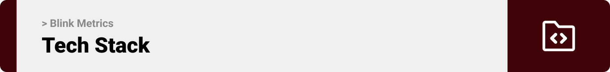

###  Predict Pro is built using the following technologies:

<a name="Frontend" ></a>
#### Frontend Development:
The Blink Matrics Dashboard is built using Laravel. Laravel is a robust PHP framework known for its elegant syntax and powerful features, making it ideal for building efficient applications.

<a name="Backend" ></a>
#### Backend Development:
For the backend, Laravel is used. 


#### Widgets:
ELFsight website is used to get widgets.

<br><br>

<!-- Demo -->
<a name="Demo" ></a>


> We implemented the Blink Matrics Dashboard with the following features:


| Dashboard | Menu | Resisable Cards | Dragging Cards |
| ---| ---| ---| ---|
| 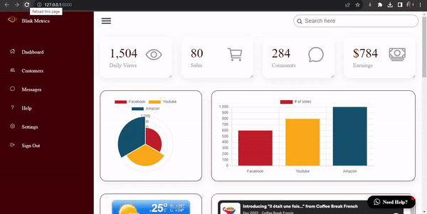 | 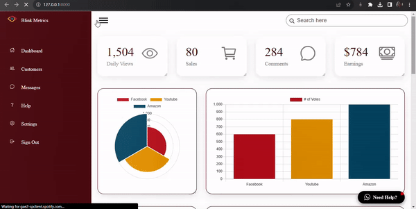 | 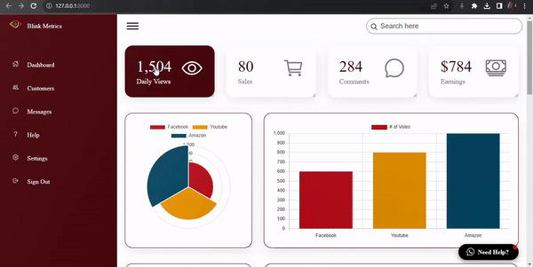 | 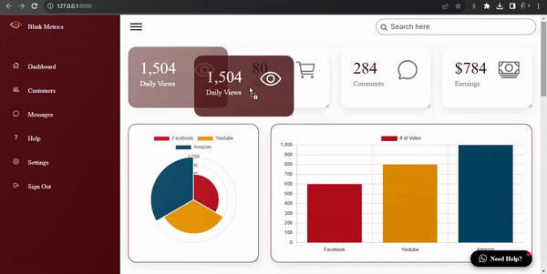 |


| Charts | News Widget | COVID 19 Widget | Stock Market Widget |
| ---| ---| ---| ---|
| 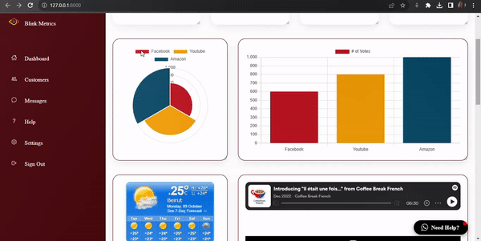 | 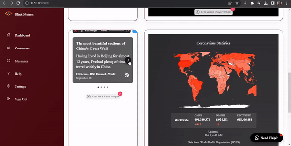 | 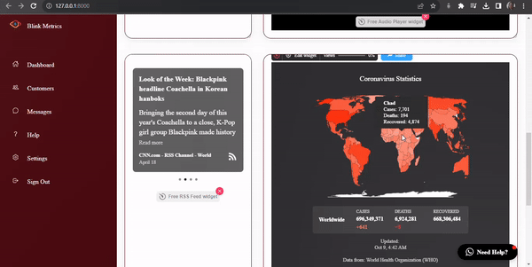 | 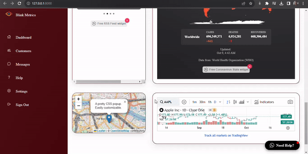 |

| Resizing | Dragging | What'sApp Widget | 
| ---| ---| ---|
| 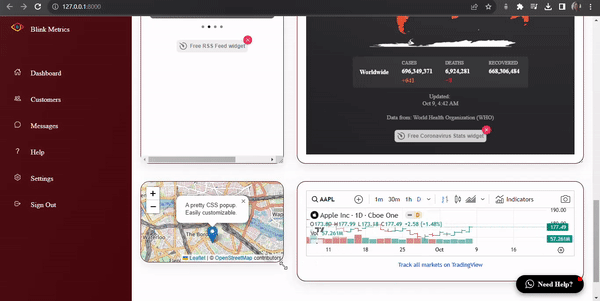 | 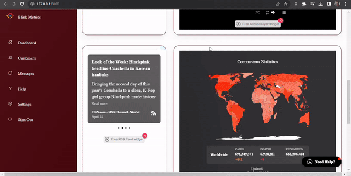 | 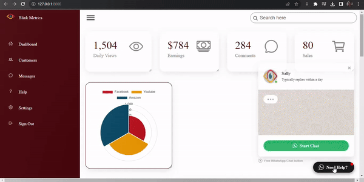 |


<br><br> 


<!-- How to run -->
<a name="how-to-run" ></a>
 

> To set up Coffee Express locally, follow these steps:

### Admin dashboard

#### Installation


1. Clone the repo
   ```sh
   git clone https://github.com/sally-AH/blink_metrics_dashboard.git
   ```
2. Install Laravel dependencies by navigating to the Laravel project directory:
   ```sh
   cd AdminDashboard
   composer install
   ```
3. Copy the example env file and make the required configuration changes in the .env file:
   ```sh
   cp .env.example .env
   ```
4. Start the local development server:
   ```sh
   php artisan serve
   ```


Now, you should be able to run Blink Matrics locally and explore its features.
